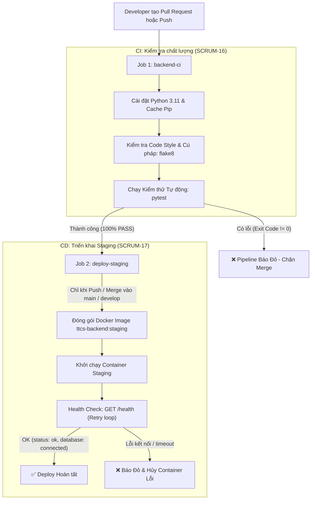

# Tài liệu Hướng dẫn CI/CD & Cấu hình Branch Protection Rules

> **Dự án:** TTCS K18C4 - Hệ thống Truy xuất nguồn gốc và Giám sát Chuỗi lạnh Nông sản  
> **Nhiệm vụ:** SCRUM-16 (S-02: Pipeline CI kiểm tra chất lượng) & SCRUM-17 (S-03: Triển khai Staging tự động & Health Check)

---

## 1. Tổng quan Kiến trúc Pipeline CI/CD

Quy trình tự động hóa được thiết lập tại file [`.github/workflows/ci.yml`](../.github/workflows/ci.yml) gồm 2 giai đoạn (Jobs):



---

## 2. Chi tiết các Bước thực hiện trong Pipeline

### Job 1: `backend-ci` (Lint & Automated Tests)
- **Kích hoạt:** Khi có bất kỳ sự kiện `push` hoặc `pull_request` đến các nhánh `main`, `master`, `develop`.
- **Môi trường:** `ubuntu-latest`, Python `3.11`.
- **Tối ưu tốc độ:** Sử dụng tính năng cache pip của GitHub Actions (`cache: "pip"` với khóa `backend/requirements.txt`) giúp rút ngắn thời gian cài đặt xuống dưới 1-2 phút.
- **Linting (`flake8`):** Kiểm tra toàn bộ mã nguồn trong thư mục `backend/app/` theo quy chuẩn thiết lập tại [`.flake8`](../.flake8). Nếu phát hiện lỗi cú pháp, biến chưa định nghĩa, hoặc vi phạm chuẩn code style, `flake8` sẽ trả về mã lỗi khác 0 và pipeline báo đỏ ngay lập tức.
- **Testing (`pytest`):** Thực thi toàn bộ 48 test cases kiểm thử tự động trong `backend/tests/`. Bất kỳ ca test nào thất bại sẽ dừng quy trình và báo đỏ.

### Job 2: `deploy-staging` (Deploy Staging & Health Check)
- **Điều kiện chạy:**
  1. Job `backend-ci` phải vượt qua thành công 100% (`needs: backend-ci`).
  2. Sự kiện phải là `push` (merge Pull Request) vào các nhánh chính: `main`, `master`, hoặc `develop`. Các Pull Request đang mở sẽ không kích hoạt deploy.
- **Đóng gói Docker:** Build Docker image `ttcs-backend:staging` từ [`backend/Dockerfile`](../backend/Dockerfile) kết hợp cache layer qua Buildx.
- **Khởi chạy & Health Check:**
  - Khởi chạy container backend trong môi trường staging độc lập.
  - Vòng lặp kiểm tra (retry loop tối đa 10 lần, mỗi lần cách nhau 3 giây) gọi vào endpoint `GET /health`.
  - Endpoint `GET /health` thực thi truy vấn trực tiếp kiểm tra kết nối DB (`SELECT 1`), trả về:
    ```json
    {
      "status": "ok",
      "database": "connected"
    }
    ```
  - Tuyệt đối không làm lộ cấu hình nhạy cảm (chuỗi kết nối, mật khẩu, file path).
  - Nếu kết quả trả về `HTTP 200` và trạng thái `ok` / `connected`, pipeline thông báo deploy thành công. Nếu thất bại sau 10 lần thử, pipeline in log lỗi và trả về exit code `1`.

---

## 3. Hướng dẫn Cấu hình Branch Protection Rule trên GitHub

Để đảm bảo quy trình kiểm soát chất lượng nghiêm ngặt và ngăn chặn việc đẩy code lỗi lên nhánh chính, quản trị viên dự án thực hiện cấu hình **Branch Protection Rule** theo các bước sau:

### Bước 1: Mở mục thiết lập nhánh trên GitHub Repo
1. Truy cập vào trang GitHub của repository dự án.
2. Nhấp vào tab **Settings** ở thanh menu trên cùng.
3. Ở thanh điều hướng bên trái, chọn mục **Branches** (trong nhóm *Code and automation*).

### Bước 2: Tạo Rule bảo vệ nhánh
1. Trong phần **Branch protection rules**, nhấp vào nút **Add branch protection rule** (hoặc **Add rule**).
2. Tại ô **Branch name pattern**, nhập tên nhánh cần bảo vệ:
   - Nhập `main` (hoặc tạo thêm rule cho `develop`).

### Bước 3: Thiết lập các ràng buộc bắt buộc
Tích chọn các mục sau:

1. **Require a pull request before merging:**
   - **Require approvals:** Chọn tối thiểu **`1`** người duyệt (review).
   - *(Tùy chọn khuyến nghị)* Tích chọn **Dismiss stale pull request approvals when new commits are pushed** (tự động hủy duyệt cũ khi có commit mới đẩy lên PR).

2. **Require status checks to pass before merging:**
   - Tích chọn **Require branches to be up to date before merging** (yêu cầu nhánh tính năng phải cập nhật code mới nhất từ nhánh chính trước khi merge).
   - Tại ô tìm kiếm **Status checks that are required**, tìm và tích chọn:
     - **`Backend Lint & Automated Tests`** (tên job trong `ci.yml`).

3. **Chặn push thẳng lên nhánh chính:**
   - Khi đã bật *Require a pull request before merging*, GitHub sẽ tự động vô hiệu hóa lệnh `git push origin main` trực tiếp.
   - Để ngăn cả quản trị viên (Admin) vô tình push đè, kéo xuống dưới và tích chọn: **Do not allow bypassing the above settings**.

### Bước 4: Lưu cấu hình
- Nhấp vào nút **Create** (hoặc **Save changes**) ở cuối trang.
- Nhập mật khẩu tài khoản GitHub nếu được yêu cầu xác thực.

---

## 4. Kiểm chứng Thực tế Quy trình

- **Kịch bản PR có lỗi lint hoặc test fail:** GitHub Actions sẽ chạy và báo đỏ `Backend Lint & Automated Tests (failure)`. Nút **Merge Pull Request** sẽ bị khóa cứng (disabled) kèm cảnh báo *"Required status check has failed"*.
- **Kịch bản PR hợp lệ và được approve:** Sau khi linter và 48 test cases đều PASS và có ít nhất 1 review approve, nút merge mở khóa màu xanh.
- **Kịch bản sau khi Merge:** Job `deploy-staging` tự động kích hoạt, đóng gói image, kiểm tra `/health` và báo trạng thái triển khai thành công.
